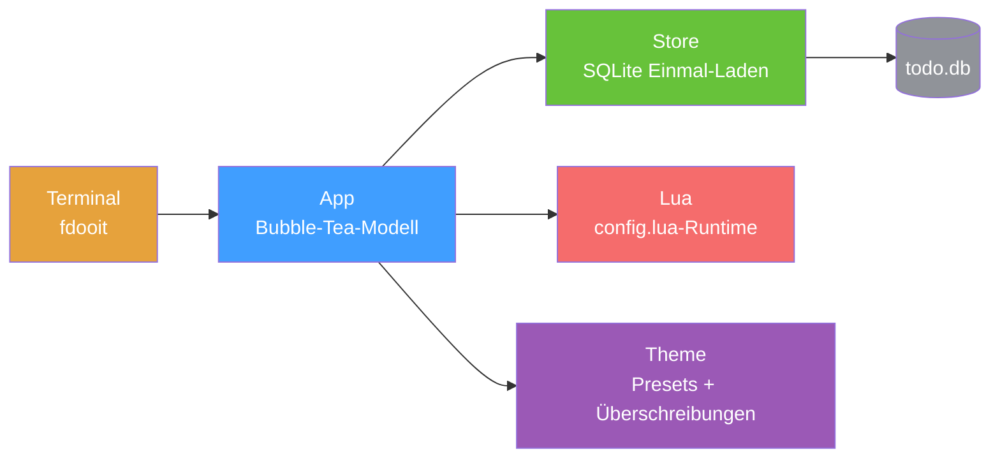

<div align="right">

[English](README.md) · [中文](README-zh.md) · [日本語](README-ja.md) · [한국어](README-ko.md) · [Español](README-es.md) · [Français](README-fr.md) · [Русский](README-ru.md) · [Deutsch](README-de.md) · [Português](README-pt-br.md)

</div>

<pre align="center">
███████╗██████╗  ██████╗  ██████╗ ██╗████████╗
██╔════╝██╔══██╗██╔═══██╗██╔═══██╗██║╚══██╔══╝
█████╗  ██║  ██║██║   ██║██║   ██║██║   ██║
██╔══╝  ██║  ██║██║   ██║██║   ██║██║   ██║
██║     ██████╔╝╚██████╔╝╚██████╔╝██║   ██║
╚═╝     ╚═════╝  ╚═════╝  ╚═════╝ ╚═╝   ╚═╝
</pre>
<h1 align="center">faster-dooit</h1>

<p align="center">
  <strong>Deine Aufgaben-App braucht zwei Sekunden zum Öffnen? Diese nicht.</strong>
  <br />
  <em>TODO-Manager im Terminal im vim-Stil · Go + Bubble Tea · 10k Aufgaben in ~34 ms</em>
</p>

<p align="center">
  <a href="#schnellstart"></a>
  <a href="LICENSE"></a>
</p>

<p align="center">
  <a href="https://github.com/XiaTian-AC/faster-dooit/releases"></a>
  
  
  
</p>

> **Nicht mit dem offiziellen [dooit](https://github.com/dooit-org/dooit)-Projekt verbunden** — dies ist ein unabhängiger Port von Grund auf. Hobby-Projekt mit KI-Unterstützung.

## Warum

Dein TODO-Tool sollte dich nicht warten lassen. Das ursprüngliche dooit zahlt **1,9 s** Kaltstart und baut bei jedem Frame den ganzen Baum neu. faster-dooit lädt **10.000 Aufgaben in ~34 ms**, rendert nur das Sichtbare und pollt nie die Datenbank. Vim für deine Aufgaben.

## Features

- ⚡ **Schnell genug, um sich sofort anzufühlen** — 10k Aufgaben in ~34 ms; das Original braucht ~1,9 s auf derselben Maschine
- 🎯 **vim-Muskelgedächtnis** — `j`/`k` bewegen, `a` hinzufügen, `d 3d` Fälligkeit, `c` abschließen
- 🗂️ **Zweispaltiger Baum mit Einklappen** — verschachtelte Workspaces und Aufgaben, `z`/`Z` einklappen, `collapse_depth` für automatisches Einklappen tiefer Knoten
- 🎨 **Themen, die passen** — 7 Presets (`nord`, `dracula`, `catppuccin_mocha`…) plus Farbüberschreibung und transparente Hintergründe
- 🔌 **Saubere Lua-Konfiguration** — ohne `api.`-Präfix: `theme.name`, `keys.set`, `vars.urgency_colors`
- 📦 **Ein einziges statisches Binary** — reines Go, kein CGO, kein Runtime, kein zu prüfender Abhängigkeitsbaum

## Schnellstart

```bash
# macOS / Linux
curl -fsSL https://raw.githubusercontent.com/XiaTian-AC/faster-dooit/main/install.sh | bash
```

```powershell
# Windows
iwr -useb https://raw.githubusercontent.com/XiaTian-AC/faster-dooit/main/install.ps1 | iex
```

Oder mit deinem Paketmanager:

```bash
brew tap XiaTian-AC/XiaTian-AC-bucket && brew install faster-dooit   # macOS/Linux
scoop bucket add faster-dooit https://github.com/XiaTian-AC/XiaTian-AC-bucket && scoop install faster-dooit  # Windows
```

Der Befehl ist `fdooit`. Build aus dem Quellcode braucht nur Go ≥ 1.22.

## Verwendung

```bash
fdooit
```

```text
┌─ Workspaces ────────────────┐  ┌─ Todos ───────────────────────────────┐
│  ⌄ Work                     │  │  ⌄ o  finish release notes   @today   │
│  > Personal                 │  │    o  write the spec                  │
└─────────────────────────────┘  └───────────────────────────────────────┘
```

- `a` Aufgabe hinzufügen · `A` Kind hinzufügen · `c` Abschluss umschalten · `d` Fälligkeit (`tomorrow`, `3d`, `next monday`)
- `z`/`Z` Knoten / Eltern einklappen · `o` lange Beschreibung aufklappen
- `S` suchen · `ctrl+s` sortieren · `y`/`Y` kopieren · `p`/`P` einfügen · `?` Hilfe
- Leere Spalten (ohne due/recurrence) werden automatisch ausgeblendet; Scrollbar auf niedrigen Terminals

## Architektur



Das Performance-Modell sind drei bewusste Entscheidungen: **Einmal-Laden** (DB beim Start in den Speicher, direktes Zurückschreiben), **nur Viewport-Rendering** (Zeilen-Cache nach `pane,id,version`) und **direktes SQLite** (reines Go, kein CGO, eine Verbindung).

## Konfiguration

`config.lua` liegt unter `~/.config/faster-dooit/config.lua` (alle Plattformen). Eine ungültige Datei zeigt einen `file:line`-Fehler und beendet sich.

| Einstellung | Beispiel |
|---|---|
| Theme | `theme.name = "dracula"` |
| Farbüberschreibung | `theme.primary = "#FF79C6"` |
| Transparenter Hintergrund | `theme.background = "transparent"` |
| Einklapp-Tiefe | `vars.collapse_depth = 0` |
| Zeilen langer Beschreibungen | `vars.max_description_lines = 3` |
| Taste neu belegen | `keys.set("i", add_sibling)` |
| Statusleiste | `bar.set({ fn, fn, ... })` |

Presets: `nord`, `catppuccin_mocha`, `catppuccin_latte`, `dracula`, `gruvbox_dark`, `solarized_light`, `tokyo_night`. Zwölf überschreibbare Farben plus `urgency_colors`.

## API

faster-dooit bietet eine **Lua-API** (eine bewusste Teilmenge der ursprünglichen Python-Oberfläche) zur Anpassung:

| API | Zweck |
|---|---|
| `keys.set(key\|{keys}, action)` | Tasten neu belegen |
| `formatter.todos.<field>.add(fn)` | Spalten stylen |
| `bar.set({fn, ...})` | Eigene Statusleiste |
| `dashboard.set({line, ...})` | Willkommensbildschirm |
| `theme` / `vars` | Farben, Presets, Einklapp-Tiefe, max. Zeilen |
| `notify(msg, level)` / `now(fmt)` | Feedback & Zeit |
| `subscribe(event, fn)` / `timer(sec, fn)` | Events & periodische Callbacks |

## Verzeichnisstruktur

```
faster-dooit/
├── main.go                  # Einstieg: Flags, Pfade, TUI-Bootstrap
├── internal/
│   ├── app/                 # Bubble-Tea-Modell: Modi, Tasten, Rendering, Scrollbar
│   ├── model/               # In-Memory-Baum: Workspace/Todo, Kaskaden
│   ├── store/               # SQLite-Persistenz: Einmal-Laden, Schreibdurchgriff
│   ├── lua/                 # Sandbox-Auswertung von config.lua
│   ├── theme/               # aufgelöstes Theme + 7 Presets
│   └── dateparse/           # natürliche Sprache ("tomorrow", "3d")
├── install.sh / install.ps1 # Einzeiler-Installer
└── config.lua               # Standard-Benutzerkonfiguration
```

## Tech-Stack

| Ebene | Technologie |
|---|---|
| Sprache | Go |
| TUI | [Bubble Tea](https://github.com/charmbracelet/bubbletea), lipgloss |
| Datenbank | SQLite (`modernc.org/sqlite`, reines Go) |
| Konfiguration | gopher-lua (Sandbox) |
| Release | GoReleaser + GitHub Actions |

## Mitwirken

1. Forke das Repo
2. Erstelle einen Branch (`git checkout -b feat/amazing`)
3. Committe deine Änderungen
4. Pushe und öffne einen Pull Request

```bash
go test ./...        # unit + parity + e2e
go vet ./...
go test ./internal/app/ -bench . -benchmem   # Performance-Gates
```

## Lizenz

[MIT](LICENSE)
