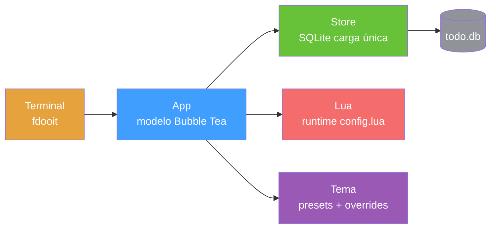

<div align="right">

[English](README.md) · [中文](README-zh.md) · [日本語](README-ja.md) · [한국어](README-ko.md) · [Español](README-es.md) · [Français](README-fr.md) · [Русский](README-ru.md) · [Deutsch](README-de.md) · [Português](README-pt-br.md)

</div>

<pre align="center">
███████╗██████╗  ██████╗  ██████╗ ██╗████████╗
██╔════╝██╔══██╗██╔═══██╗██╔═══██╗██║╚══██╔══╝
█████╗  ██║  ██║██║   ██║██║   ██║██║   ██║
██╔══╝  ██║  ██║██║   ██║██║   ██║██║   ██║
██║     ██████╔╝╚██████╔╝╚██████╔╝██║   ██║
╚═╝     ╚═════╝  ╚═════╝  ╚═════╝ ╚═╝   ╚═╝
</pre>
<h1 align="center">faster-dooit</h1>

<p align="center">
  <strong>Tu app de tareas tarda dos segundos en abrir. Esta no.</strong>
  <br />
  <em>gestor de tareas de terminal estilo vim · Go + Bubble Tea · 10k tareas en ~34 ms</em>
</p>

<p align="center">
  <a href="#inicio-rápido"></a>
  <a href="LICENSE"></a>
</p>

<p align="center">
  <a href="https://github.com/XiaTian-AC/faster-dooit/releases"></a>
  
  
  
</p>

> **Sin relación con el proyecto oficial [dooit](https://github.com/dooit-org/dooit)** — es un port independiente escrito desde cero. Proyecto hobby asistido por IA.

## Por qué

Tu herramienta de tareas no debería hacerte esperar. El dooit original paga **1.9 s** de arranque en frío y reconstruye todo el árbol en cada frame. faster-dooit carga **10,000 tareas en ~34 ms**, renderiza solo lo visible y nunca consulta la base de datos. Es vim, para tus tareas.

## Características

- ⚡ **Rápido como para sentirlo al instante** — 10k tareas cargadas en ~34 ms; el original tarda ~1.9 s en la misma máquina
- 🎯 **Memoria muscular de vim** — `j`/`k` moverse, `a` añadir, `d 3d` fijar fecha, `c` completar
- 🗂️ **Árbol de dos paneles con plegado** — workspaces y tareas anidados, `z`/`Z` para plegar, `collapse_depth` para auto-plegar nodos profundos
- 🎨 **Temas que encajan** — 7 presets (`nord`, `dracula`, `catppuccin_mocha`…) más sobrescritura de colores y fondos transparentes
- 🔌 **Configuración Lua limpia** — sin prefijo `api.`: `theme.name`, `keys.set`, `vars.urgency_colors`
- 📦 **Un solo binario estático** — Go puro, sin CGO, sin runtime, sin árbol de dependencias que auditar

## Inicio rápido

```bash
# macOS / Linux
curl -fsSL https://raw.githubusercontent.com/XiaTian-AC/faster-dooit/main/install.sh | bash
```

```powershell
# Windows
iwr -useb https://raw.githubusercontent.com/XiaTian-AC/faster-dooit/main/install.ps1 | iex
```

O con tu gestor de paquetes:

```bash
brew tap XiaTian-AC/XiaTian-AC-bucket && brew install faster-dooit   # macOS/Linux
scoop bucket add faster-dooit https://github.com/XiaTian-AC/XiaTian-AC-bucket && scoop install faster-dooit  # Windows
```

El comando es `fdooit`. Compilar desde el código fuente solo requiere Go ≥ 1.22.

## Uso

```bash
fdooit
```

```text
┌─ Workspaces ────────────────┐  ┌─ Todos ───────────────────────────────┐
│  ⌄ Work                     │  │  ⌄ o  finish release notes   @today   │
│  > Personal                 │  │    o  write the spec                  │
└─────────────────────────────┘  └───────────────────────────────────────┘
```

- `a` añadir tarea · `A` añadir hijo · `c` alternar completado · `d` fijar fecha (`tomorrow`, `3d`, `next monday`)
- `z`/`Z` plegar un nodo / su padre · `o` expandir una descripción larga
- `S` buscar · `ctrl+s` ordenar · `y`/`Y` copiar · `p`/`P` pegar · `?` ayuda
- Las columnas vacías (sin due/recurrence) se ocultan; la barra de desplazamiento aparece en terminales bajas

## Arquitectura



El modelo de rendimiento son tres decisiones deliberadas: **carga única** (DB a memoria al iniciar, escritura directa), **renderizado solo de viewport** (caché de filas por `pane,id,version`) y **SQLite directo** (Go puro, sin CGO, conexión única).

## Configuración

`config.lua` está en `~/.config/faster-dooit/config.lua` (todas las plataformas). Un archivo inválido muestra un error `file:line` y sale.

| Ajuste | Ejemplo |
|---|---|
| Tema | `theme.name = "dracula"` |
| Sobrescribir color | `theme.primary = "#FF79C6"` |
| Fondo transparente | `theme.background = "transparent"` |
| Profundidad de plegado | `vars.collapse_depth = 0` |
| Líneas de descripción larga | `vars.max_description_lines = 3` |
| Reasignar tecla | `keys.set("i", add_sibling)` |
| Barra de estado | `bar.set({ fn, fn, ... })` |

Presets: `nord`, `catppuccin_mocha`, `catppuccin_latte`, `dracula`, `gruvbox_dark`, `solarized_light`, `tokyo_night`. Doce colores sobrescribibles más `urgency_colors`.

## API

faster-dooit expone una **API Lua** (un subconjunto deliberado de la superficie Python original) para personalizar:

| API | Propósito |
|---|---|
| `keys.set(key\|{keys}, action)` | Reasignar teclas |
| `formatter.todos.<field>.add(fn)` | Estilizar columnas |
| `bar.set({fn, ...})` | Barra de estado a medida |
| `dashboard.set({line, ...})` | Pantalla de bienvenida |
| `theme` / `vars` | Colores, presets, profundidad de plegado, líneas máx |
| `notify(msg, level)` / `now(fmt)` | Feedback y tiempo |
| `subscribe(event, fn)` / `timer(sec, fn)` | Eventos y callbacks periódicos |

## Estructura de directorios

```
faster-dooit/
├── main.go                  # entrada: flags, rutas, arranque TUI
├── internal/
│   ├── app/                 # modelo Bubble Tea: modos, teclas, render, scrollbar
│   ├── model/               # árbol en memoria: Workspace/Todo, cascadas
│   ├── store/               # persistencia SQLite: carga única, escritura directa
│   ├── lua/                 # evaluación de config.lua en sandbox
│   ├── theme/               # tema resuelto + 7 presets
│   └── dateparse/           # fechas en lenguaje natural ("tomorrow", "3d")
├── install.sh / install.ps1 # instaladores de una línea
└── config.lua               # configuración de usuario por defecto
```

## Stack tecnológico

| Capa | Tecnología |
|---|---|
| Lenguaje | Go |
| TUI | [Bubble Tea](https://github.com/charmbracelet/bubbletea), lipgloss |
| Base de datos | SQLite (`modernc.org/sqlite`, Go puro) |
| Configuración | gopher-lua (sandbox) |
| Release | GoReleaser + GitHub Actions |

## Contribuir

1. Haz un fork del repo
2. Crea una rama (`git checkout -b feat/amazing`)
3. Confirma tus cambios
4. Haz push y abre un Pull Request

```bash
go test ./...        # unit + parity + e2e
go vet ./...
go test ./internal/app/ -bench . -benchmem   # compuertas de rendimiento
```

## Licencia

[MIT](LICENSE)
