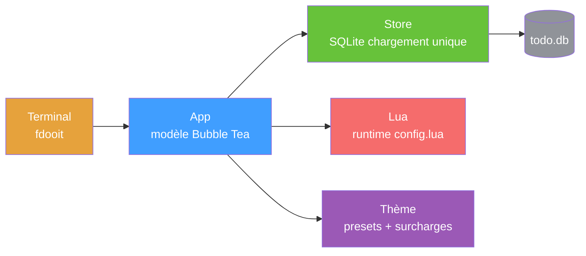

<div align="right">

[English](README.md) · [中文](README-zh.md) · [日本語](README-ja.md) · [한국어](README-ko.md) · [Español](README-es.md) · [Français](README-fr.md) · [Русский](README-ru.md) · [Deutsch](README-de.md) · [Português](README-pt-br.md)

</div>

<h1 align="center">faster-dooit</h1>

<p align="center">
  <strong>Votre app de tâches met deux secondes à s'ouvrir. Pas celle-ci.</strong>
  <br />
  <em>gestionnaire de tâches en terminal, style vim · Go + Bubble Tea · 10k tâches en ~34 ms</em>
</p>

<p align="center">
  <a href="#démarrage-rapide"></a>
  <a href="LICENSE"></a>
</p>

<p align="center">
  <a href="https://github.com/XiaTian-AC/faster-dooit/releases"></a>
  
  
  
</p>

> **Sans lien avec le projet officiel [dooit](https://github.com/dooit-org/dooit)** — il s'agit d'un port indépendant écrit de zéro. Projet hobby assisté par IA.

## Pourquoi

Votre outil de tâches ne devrait pas vous faire attendre. Le dooit original paie **1,9 s** de démarrage à froid et reconstruit tout son arbre à chaque frame. faster-dooit charge **10 000 tâches en ~34 ms**, ne rend que ce qui est visible et ne sonde jamais la base de données. C'est vim, pour vos tâches.

## Fonctionnalités

- ⚡ **Assez rapide pour sembler instantané** — 10k tâches chargées en ~34 ms ; l'original met ~1,9 s sur la même machine
- 🎯 **Mémoire musculaire de vim** — `j`/`k` se déplacer, `a` ajouter, `d 3d` fixer une échéance, `c` terminer
- 🗂️ **Arbre à deux volets** — workspaces et tâches imbriqués, cascades de complétion, dates en langage naturel, récurrence
- 🎨 **Des thèmes qui collent** — 7 presets (`nord`, `dracula`, `catppuccin_mocha`…) plus surcharge de couleurs et fonds transparents
- 🔌 **Configuration Lua** — réassigner les touches, styliser les colonnes, barre d'état sur mesure — tout dans `config.lua`
- 📦 **Un seul binaire statique** — Go pur, sans CGO, sans runtime

## Démarrage rapide

```bash
# macOS / Linux
curl -fsSL https://raw.githubusercontent.com/XiaTian-AC/faster-dooit/main/install.sh | bash
```

```powershell
# Windows
iwr -useb https://raw.githubusercontent.com/XiaTian-AC/faster-dooit/main/install.ps1 | iex
```

Ou avec votre gestionnaire de paquets :

```bash
brew tap XiaTian-AC/XiaTian-AC-bucket && brew install faster-dooit   # macOS/Linux
scoop bucket add faster-dooit https://github.com/XiaTian-AC/XiaTian-AC-bucket && scoop install faster-dooit  # Windows
```

La commande est `fdooit`. Compiler depuis le code source ne nécessite que Go ≥ 1.22.

## Utilisation

```bash
fdooit
```

```text
┌─ Workspaces ────────────────┐  ┌─ Todos ───────────────────────────────┐
│  Work                       │  │  o  finish release notes     @today   │
│  Personal                   │  │  o  write the spec                    │
└─────────────────────────────┘  └───────────────────────────────────────┘
```

- `a` ajouter une tâche · `A` ajouter un enfant · `c` basculer le statut · `d` fixer l'échéance (`tomorrow`, `3d`, `next monday`)
- `S` rechercher · `ctrl+s` trier · `y`/`Y` copier · `p`/`P` coller · `?` aide
- Barre de défilement sur les terminaux bas — le curseur suit votre position

## Architecture



Le modèle de performance repose sur trois choix délibérés : **chargement unique** (DB en mémoire au démarrage, écriture directe), **rendu viewport uniquement** (cache de lignes par `pane,id,version`) et **SQLite direct** (Go pur, sans CGO, connexion unique).

## Configuration

`config.lua` se trouve dans `~/.config/faster-dooit/config.lua` (toutes plateformes). Un fichier invalide affiche une erreur `file:line` et quitte.

| Réglage | Exemple |
|---|---|
| Thème | `api.vars.theme.name = "dracula"` |
| Surcharge couleur | `api.vars.theme.primary = "#FF79C6"` |
| Fond transparent | `api.vars.theme.background = "transparent"` |
| Réassigner touche | `api.keys.set("i", api.add_sibling)` |
| Barre d'état | `api.bar.set({ fn, fn, ... })` |

Presets : `nord`, `catppuccin_mocha`, `catppuccin_latte`, `dracula`, `gruvbox_dark`, `solarized_light`, `tokyo_night`. Douze couleurs surchargables plus `urgency_colors`.

## API

faster-dooit expose une **API Lua** (un sous-ensemble délibéré de la surface Python d'origine) pour personnaliser :

| API | Objectif |
|---|---|
| `api.keys.set(key\|{keys}, action)` | Réassigner les touches |
| `api.formatter.todos.<field>.add(fn)` | Styliser les colonnes |
| `api.bar.set({fn, ...})` | Barre d'état sur mesure |
| `api.dashboard.set({line, ...})` | Écran de bienvenue |
| `api.vars.theme` | Couleurs + presets |
| `subscribe(event, fn)` / `timer(sec, fn)` | Événements et callbacks périodiques |

## Structure des répertoires

```
faster-dooit/
├── main.go                  # entrée : flags, chemins, démarrage TUI
├── internal/
│   ├── app/                 # modèle Bubble Tea : modes, touches, rendu, scrollbar
│   ├── model/               # arbre en mémoire : Workspace/Todo, cascades
│   ├── store/               # persistance SQLite : chargement unique, écriture directe
│   ├── lua/                 # évaluation de config.lua en sandbox
│   ├── theme/               # thème résolu + 7 presets
│   └── dateparse/           # dates en langage naturel ("tomorrow", "3d")
└── config.lua               # configuration utilisateur par défaut
```

## Stack technique

| Couche | Technologie |
|---|---|
| Langage | Go |
| TUI | [Bubble Tea](https://github.com/charmbracelet/bubbletea), lipgloss |
| Base de données | SQLite (`modernc.org/sqlite`, Go pur) |
| Configuration | gopher-lua (sandbox) |
| Release | GoReleaser + GitHub Actions |

## Contribuer

1. Forkez le dépôt
2. Créez une branche (`git checkout -b feat/amazing`)
3. Commitez vos changements
4. Poussez et ouvrez une Pull Request

```bash
go test ./...        # unit + parity + e2e
go vet ./...
go test ./internal/app/ -bench . -benchmem   # portes de performance
```

## Licence

[MIT](LICENSE)
