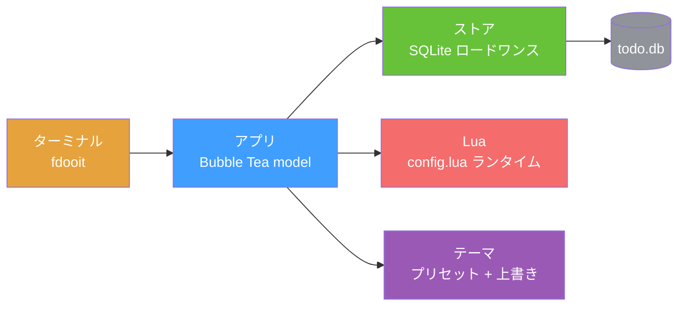

<div align="right">

[English](README.md) · [中文](README-zh.md) · [日本語](README-ja.md) · [한국어](README-ko.md) · [Español](README-es.md) · [Français](README-fr.md) · [Русский](README-ru.md) · [Deutsch](README-de.md) · [Português](README-pt-br.md)

</div>

<h1 align="center">faster-dooit</h1>

<p align="center">
  <strong>TODO アプリが開くのに2秒かかる？ これはかかりません。</strong>
  <br />
  <em>vim スタイルのターミナル TODO マネージャー · Go + Bubble Tea · 1万件の TODO を約34msで</em>
</p>

<p align="center">
  <a href="#クイックスタート"></a>
  <a href="LICENSE"></a>
</p>

<p align="center">
  <a href="https://github.com/XiaTian-AC/faster-dooit/releases"></a>
  
  
  
</p>

> **公式 [dooit](https://github.com/dooit-org/dooit) プロジェクトとは無関係** — これは独立したスクラッチからの移植です。AI 支援の趣味プロジェクト。

## なぜ

TODO ツールに待たされるべきではありません。オリジナルの dooit は**1.9 秒**のコールドスタートと、毎フレームのツリー再構築を強いられます。faster-dooit は**1万件の TODO を約34msで**読み込み、表示部分だけをレンダリングし、データベースをポーリングしません。TODO に vim を。

## 機能

- ⚡ **瞬時に感じられる速さ** — 1万件を約34msでコールドロード（同機のオリジナルは約1.9秒）
- 🎯 **vim の筋肉記憶** — `j`/`k` 移動、`a` 追加、`d 3d` 期限設定、`c` 完了
- 🗂️ **折りたたみ対応の2ペインツリー** — ネストしたワークスペース + TODO、`z`/`Z` で折りたたみ、`collapse_depth` で深いノードを自動折りたたみ
- 🎨 **フィットするテーマ** — 7つのプリセット（`nord`、`dracula`、`catppuccin_mocha`…）+ 色の上書きと透明背景
- 🔌 **クリーンな Lua 設定** — `api.` プレフィックスなし：`theme.name`、`keys.set`、`vars.urgency_colors`
- 📦 **単一の静的バイナリ** — 純粋な Go、CGO なし、ランタイムなし、監査不要の依存ツリー

## クイックスタート

```bash
# macOS / Linux
curl -fsSL https://raw.githubusercontent.com/XiaTian-AC/faster-dooit/main/install.sh | bash
```

```powershell
# Windows
iwr -useb https://raw.githubusercontent.com/XiaTian-AC/faster-dooit/main/install.ps1 | iex
```

またはパッケージマネージャーで：

```bash
brew tap XiaTian-AC/XiaTian-AC-bucket && brew install faster-dooit   # macOS/Linux
scoop bucket add faster-dooit https://github.com/XiaTian-AC/XiaTian-AC-bucket && scoop install faster-dooit  # Windows
```

コマンドは `fdooit` です。ソースからビルドするには Go ≥ 1.22 のみ。

## 使い方

```bash
fdooit
```

```text
┌─ Workspaces ────────────────┐  ┌─ Todos ───────────────────────────────┐
│  ⌄ Work                     │  │  ⌄ o  finish release notes   @today   │
│  > Personal                 │  │    o  write the spec                  │
└─────────────────────────────┘  └───────────────────────────────────────┘
```

- `a` TODO追加 · `A` 子項目追加 · `c` 完了切替 · `d` 期限設定（`tomorrow`、`3d`、`next monday`）
- `z`/`Z` ノード / 親を折りたたみ · `o` 長い説明を展開
- `S` 検索 · `ctrl+s` ソート · `y`/`Y` コピー · `p`/`P` ペースト · `?` ヘルプ
- 空の列（due/recurrence なし）は自動で非表示；短いターミナルではスクロールバーが自動表示

## アーキテクチャ



パフォーマンスモデルは3つの意図的な選択：**ロードワンス**（起動時に DB をメモリへ、編集は即書き込み）、**ビューポートのみレンダリング**（`pane,id,version` で行キャッシュ）、**直接 SQLite**（純 Go、CGO なし、単一接続）。

## 設定

`config.lua` は `~/.config/faster-dooit/config.lua` に置きます（全プラットフォーム共通）。無効な設定は `file:line` エラーを表示して終了します。

| 設定 | 例 |
|---|---|
| テーマ | `theme.name = "dracula"` |
| 色の上書き | `theme.primary = "#FF79C6"` |
| 透明背景 | `theme.background = "transparent"` |
| 折りたたみ深度 | `vars.collapse_depth = 0` |
| 長い説明の行数 | `vars.max_description_lines = 3` |
| キー再マップ | `keys.set("i", add_sibling)` |
| ステータスバー | `bar.set({ fn, fn, ... })` |

プリセット：`nord`、`catppuccin_mocha`、`catppuccin_latte`、`dracula`、`gruvbox_dark`、`solarized_light`、`tokyo_night`。12色の上書き可能な色と `urgency_colors`。

## API

faster-dooit はカスタマイズ用の **Lua API**（元の Python API の意図的なサブセット）を提供します：

| API | 用途 |
|---|---|
| `keys.set(key\|{keys}, action)` | キー再マップ |
| `formatter.todos.<field>.add(fn)` | 列スタイル |
| `bar.set({fn, ...})` | カスタムステータスバー |
| `dashboard.set({line, ...})` | ウェルカム画面 |
| `theme` / `vars` | 色、プリセット、折りたたみ深度、最大行数 |
| `notify(msg, level)` / `now(fmt)` | フィードバックと時間 |
| `subscribe(event, fn)` / `timer(sec, fn)` | イベント & 定期コールバック |

## ディレクトリ構造

```
faster-dooit/
├── main.go                  # エントリ：フラグ、パス、TUI 起動
├── internal/
│   ├── app/                 # Bubble Tea model：モード、キー、描画、スクロールバー
│   ├── model/               # メモリ内ツリー：Workspace/Todo、カスケード
│   ├── store/               # SQLite 永続化：ロードワンス、ライトスルー
│   ├── lua/                 # サンドボックス化された config.lua
│   ├── theme/               # 解決済みテーマ + 7 プリセット
│   └── dateparse/           # 自然言語日付（"tomorrow"、"3d"）
├── install.sh / install.ps1 # ワンラインインストーラー
└── config.lua               # デフォルトユーザー設定
```

## 技術スタック

| 層 | 技術 |
|---|---|
| 言語 | Go |
| TUI | [Bubble Tea](https://github.com/charmbracelet/bubbletea)、lipgloss |
| データベース | SQLite（`modernc.org/sqlite`、純 Go） |
| 設定 | gopher-lua（サンドボックス） |
| リリース | GoReleaser + GitHub Actions |

## コントリビュート

1. リポジトリをフォーク
2. ブランチを作成（`git checkout -b feat/amazing`）
3. 変更をコミット
4. Push して Pull Request を開く

```bash
go test ./...        # unit + parity + e2e
go vet ./...
go test ./internal/app/ -bench . -benchmem   # パフォーマンスゲート
```

## ライセンス

[MIT](LICENSE)
