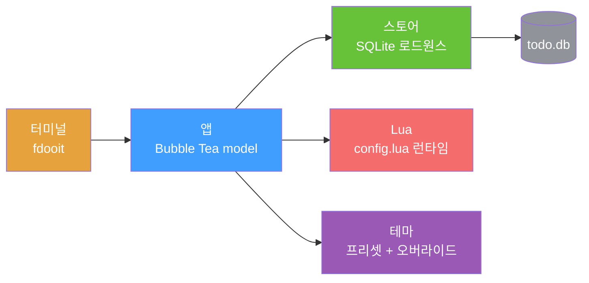

<div align="right">

[English](README.md) · [中文](README-zh.md) · [日本語](README-ja.md) · [한국어](README-ko.md) · [Español](README-es.md) · [Français](README-fr.md) · [Русский](README-ru.md) · [Deutsch](README-de.md) · [Português](README-pt-br.md)

</div>

<h1 align="center">faster-dooit</h1>

<p align="center">
  <strong>당신의 할일 앱이 열리는 데 2초가 걸린다? 이건 그렇지 않습니다.</strong>
  <br />
  <em>vim 스타일 터미널 할일 관리자 · Go + Bubble Tea · 1만 개 할일을 약 34ms에</em>
</p>

<p align="center">
  <a href="#빠른-시작"></a>
  <a href="LICENSE"></a>
</p>

<p align="center">
  <a href="https://github.com/XiaTian-AC/faster-dooit/releases"></a>
  
  
  
</p>

> **공식 [dooit](https://github.com/dooit-org/dooit) 프로젝트와 무관** — 독립적인 처음부터 다시 쓴 포팅입니다. AI 지원 취미 프로젝트.

## 왜

할일 도구가 여러분을 기다리게 해서는 안 됩니다. 원본 dooit은 **1.9초**의 콜드 스타트와 매 프레임 트리 재구성을 요구합니다. faster-dooit은 **1만 개의 할일을 약 34ms로** 불러오고 보이는 부분만 렌더링하며 데이터베이스를 폴링하지 않습니다. 할일에 vim을.

## 기능

- ⚡ **즉각적으로 느껴지는 속도** — 1만 개를 약 34ms로 콜드 로드 (동일 기기에서 원본 약 1.9초)
- 🎯 **vim 근육 기억** — `j`/`k` 이동, `a` 추가, `d 3d` 마감일 설정, `c` 완료
- 🗂️ **2-팬 트리** — 중첩 워크스페이스 + 할일, 완료 캐스케이드, 자연어 날짜, 반복
- 🎨 **맞는 테마** — 7개 프리셋 (`nord`, `dracula`, `catppuccin_mocha`…) + 색상 오버라이드 및 투명 배경
- 🔌 **Lua 설정** — 키 리맵, 열 스타일, 커스텀 상태바 — 전부 `config.lua`
- 📦 **단일 정적 바이너리** — 순수 Go, CGO 없음, 런타임 없음

## 빠른 시작

```bash
# macOS / Linux
curl -fsSL https://raw.githubusercontent.com/XiaTian-AC/faster-dooit/main/install.sh | bash
```

```powershell
# Windows
iwr -useb https://raw.githubusercontent.com/XiaTian-AC/faster-dooit/main/install.ps1 | iex
```

또는 패키지 매니저로:

```bash
brew tap XiaTian-AC/XiaTian-AC-bucket && brew install faster-dooit   # macOS/Linux
scoop bucket add faster-dooit https://github.com/XiaTian-AC/XiaTian-AC-bucket && scoop install faster-dooit  # Windows
```

명령어는 `fdooit`입니다. 소스 빌드는 Go ≥ 1.22만 필요합니다.

## 사용법

```bash
fdooit
```

```text
┌─ Workspaces ────────────────┐  ┌─ Todos ───────────────────────────────┐
│  Work                       │  │  o  finish release notes     @today   │
│  Personal                   │  │  o  write the spec                    │
└─────────────────────────────┘  └───────────────────────────────────────┘
```

- `a` 할일 추가 · `A` 자식 추가 · `c` 완료 토글 · `d` 마감일 설정 (`tomorrow`, `3d`, `next monday`)
- `S` 검색 · `ctrl+s` 정렬 · `y`/`Y` 복사 · `p`/`P` 붙여넣기 · `?` 도움말
- 짧은 터미널에 스크롤바 자동 표시 — 썸이 위치를 따라감

## 아키텍처



성능 모델은 세 가지 의도적 선택: **로드원스** (시작 시 DB를 메모리로, 편집 즉시 기록), **뷰포트 전용 렌더링** (`pane,id,version`으로 행 캐시), **직접 SQLite** (순수 Go, CGO 없음, 단일 연결).

## 설정

`config.lua`는 `~/.config/faster-dooit/config.lua`에 있습니다 (전 플랫폼 공통). 잘못된 설정은 `file:line` 오류를 출력하고 종료합니다.

| 설정 | 예 |
|---|---|
| 테마 | `api.vars.theme.name = "dracula"` |
| 색상 오버라이드 | `api.vars.theme.primary = "#FF79C6"` |
| 투명 배경 | `api.vars.theme.background = "transparent"` |
| 키 리맵 | `api.keys.set("i", api.add_sibling)` |
| 상태바 | `api.bar.set({ fn, fn, ... })` |

프리셋: `nord`, `catppuccin_mocha`, `catppuccin_latte`, `dracula`, `gruvbox_dark`, `solarized_light`, `tokyo_night`. 12개 오버라이드 가능 색상 + `urgency_colors`.

## API

faster-dooit은 커스터마이징을 위한 **Lua API** (원본 Python API의 의도적 하위 집합)를 제공합니다:

| API | 용도 |
|---|---|
| `api.keys.set(key\|{keys}, action)` | 키 리맵 |
| `api.formatter.todos.<field>.add(fn)` | 열 스타일 |
| `api.bar.set({fn, ...})` | 커스텀 상태바 |
| `api.dashboard.set({line, ...})` | 웰컴 화면 |
| `api.vars.theme` | 색상 + 프리셋 |
| `subscribe(event, fn)` / `timer(sec, fn)` | 이벤트 & 주기 콜백 |

## 디렉토리 구조

```
faster-dooit/
├── main.go                  # 진입점: 플래그, 경로, TUI 부트스트랩
├── internal/
│   ├── app/                 # Bubble Tea model: 모드, 키, 렌더링, 스크롤바
│   ├── model/               # 인메모리 트리: Workspace/Todo, 캐스케이드
│   ├── store/               # SQLite 영속화: 로드원스, 라이트스루
│   ├── lua/                 # 샌드박스 config.lua 평가
│   ├── theme/               # 해석된 테마 + 7 프리셋
│   └── dateparse/           # 자연어 날짜 ("tomorrow", "3d")
└── config.lua               # 기본 사용자 설정
```

## 기술 스택

| 계층 | 기술 |
|---|---|
| 언어 | Go |
| TUI | [Bubble Tea](https://github.com/charmbracelet/bubbletea), lipgloss |
| 데이터베이스 | SQLite (`modernc.org/sqlite`, 순수 Go) |
| 설정 | gopher-lua (샌드박스) |
| 릴리스 | GoReleaser + GitHub Actions |

## 기여

1. 저장소를 포크
2. 브랜치 생성 (`git checkout -b feat/amazing`)
3. 변경사항 커밋
4. Push 후 Pull Request 열기

```bash
go test ./...        # unit + parity + e2e
go vet ./...
go test ./internal/app/ -bench . -benchmem   # 성능 게이트
```

## 라이선스

[MIT](LICENSE)
