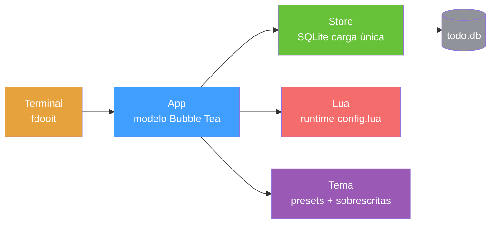

<div align="right">

[English](README.md) · [中文](README-zh.md) · [日本語](README-ja.md) · [한국어](README-ko.md) · [Español](README-es.md) · [Français](README-fr.md) · [Русский](README-ru.md) · [Deutsch](README-de.md) · [Português](README-pt-br.md)

</div>

<pre align="center">
███████╗██████╗  ██████╗  ██████╗ ██╗████████╗
██╔════╝██╔══██╗██╔═══██╗██╔═══██╗██║╚══██╔══╝
█████╗  ██║  ██║██║   ██║██║   ██║██║   ██║
██╔══╝  ██║  ██║██║   ██║██║   ██║██║   ██║
██║     ██████╔╝╚██████╔╝╚██████╔╝██║   ██║
╚═╝     ╚═════╝  ╚═════╝  ╚═════╝ ╚═╝   ╚═╝
</pre>
<h1 align="center">faster-dooit</h1>

<p align="center">
  <strong>Seu app de tarefas demora dois segundos para abrir? Este não.</strong>
  <br />
  <em>gerenciador de tarefas no terminal, estilo vim · Go + Bubble Tea · 10k tarefas em ~34 ms</em>
</p>

<p align="center">
  <a href="#início-rápido"></a>
  <a href="LICENSE"></a>
</p>

<p align="center">
  <a href="https://github.com/XiaTian-AC/faster-dooit/releases"></a>
  
  
  
</p>

> **Não afiliado ao projeto oficial [dooit](https://github.com/dooit-org/dooit)** — é um port independente escrito do zero. Projeto hobby assistido por IA.

## Por quê

Sua ferramenta de tarefas não deveria te fazer esperar. O dooit original paga **1,9 s** de inicialização a frio e reconstrói toda a árvore a cada frame. O faster-dooit carrega **10.000 tarefas em ~34 ms**, renderiza só o visível e nunca consulta o banco. É vim para suas tarefas.

## Recursos

- ⚡ **Rápido o suficiente para parecer instantâneo** — 10k tarefas em ~34 ms; o original leva ~1,9 s na mesma máquina
- 🎯 **Memória muscular do vim** — `j`/`k` mover, `a` adicionar, `d 3d` prazo, `c` concluir
- 🗂️ **Árvore de dois painéis com recolhimento** — workspaces e tarefas aninhados, `z`/`Z` para recolher, `collapse_depth` para auto-recolher nós profundos
- 🎨 **Temas que encaixam** — 7 presets (`nord`, `dracula`, `catppuccin_mocha`…) mais sobrescrita de cores e fundos transparentes
- 🔌 **Configuração Lua limpa** — sem prefixo `api.`: `theme.name`, `keys.set`, `vars.urgency_colors`
- 📦 **Um único binário estático** — Go puro, sem CGO, sem runtime, sem árvore de dependências para auditar

## Início rápido

```bash
# macOS / Linux
curl -fsSL https://raw.githubusercontent.com/XiaTian-AC/faster-dooit/main/install.sh | bash
```

```powershell
# Windows
iwr -useb https://raw.githubusercontent.com/XiaTian-AC/faster-dooit/main/install.ps1 | iex
```

Ou com seu gerenciador de pacotes:

```bash
brew tap XiaTian-AC/XiaTian-AC-bucket && brew install faster-dooit   # macOS/Linux
scoop bucket add faster-dooit https://github.com/XiaTian-AC/XiaTian-AC-bucket && scoop install faster-dooit  # Windows
```

O comando é `fdooit`. Compilar do código-fonte exige apenas Go ≥ 1.22.

## Uso

```bash
fdooit
```

```text
┌─ Workspaces ────────────────┐  ┌─ Todos ───────────────────────────────┐
│  ⌄ Work                     │  │  ⌄ o  finish release notes   @today   │
│  > Personal                 │  │    o  write the spec                  │
└─────────────────────────────┘  └───────────────────────────────────────┘
```

- `a` adicionar tarefa · `A` adicionar filha · `c` alternar conclusão · `d` definir prazo (`tomorrow`, `3d`, `next monday`)
- `z`/`Z` recolher um nó / seu pai · `o` expandir uma descrição longa
- `S` buscar · `ctrl+s` ordenar · `y`/`Y` copiar · `p`/`P` colar · `?` ajuda
- Colunas vazias (sem due/recurrence) ficam ocultas; barra de rolagem em terminais baixos

## Arquitetura



O modelo de desempenho são três decisões deliberadas: **carga única** (banco na memória na inicialização, escrita direta), **renderização só do viewport** (cache de linhas por `pane,id,version`) e **SQLite direto** (Go puro, sem CGO, conexão única).

## Configuração

`config.lua` fica em `~/.config/faster-dooit/config.lua` (todas as plataformas). Um arquivo inválido mostra um erro `file:line` e sai.

| Configuração | Exemplo |
|---|---|
| Tema | `theme.name = "dracula"` |
| Sobrescrever cor | `theme.primary = "#FF79C6"` |
| Fundo transparente | `theme.background = "transparent"` |
| Profundidade de recolhimento | `vars.collapse_depth = 0` |
| Linhas de descrição longa | `vars.max_description_lines = 3` |
| Remapear tecla | `keys.set("i", add_sibling)` |
| Barra de status | `bar.set({ fn, fn, ... })` |

Presets: `nord`, `catppuccin_mocha`, `catppuccin_latte`, `dracula`, `gruvbox_dark`, `solarized_light`, `tokyo_night`. Doze cores sobrescrevíveis mais `urgency_colors`.

## API

O faster-dooit expõe uma **API Lua** (um subconjunto deliberado da superfície Python original) para personalização:

| API | Objetivo |
|---|---|
| `keys.set(key\|{keys}, action)` | Remapear teclas |
| `formatter.todos.<field>.add(fn)` | Estilizar colunas |
| `bar.set({fn, ...})` | Barra de status personalizada |
| `dashboard.set({line, ...})` | Tela de boas-vindas |
| `theme` / `vars` | Cores, presets, profundidade de recolhimento, linhas máx |
| `notify(msg, level)` / `now(fmt)` | Feedback e tempo |
| `subscribe(event, fn)` / `timer(sec, fn)` | Eventos e callbacks periódicos |

## Estrutura de diretórios

```
faster-dooit/
├── main.go                  # entrada: flags, caminhos, inicialização TUI
├── internal/
│   ├── app/                 # modelo Bubble Tea: modos, teclas, render, scrollbar
│   ├── model/               # árvore em memória: Workspace/Todo, cascatas
│   ├── store/               # persistência SQLite: carga única, escrita direta
│   ├── lua/                 # avaliação de config.lua em sandbox
│   ├── theme/               # tema resolvido + 7 presets
│   └── dateparse/           # datas em linguagem natural ("tomorrow", "3d")
├── install.sh / install.ps1 # instaladores de uma linha
└── config.lua               # configuração padrão do usuário
```

## Stack de tecnologia

| Camada | Tecnologia |
|---|---|
| Linguagem | Go |
| TUI | [Bubble Tea](https://github.com/charmbracelet/bubbletea), lipgloss |
| Banco de dados | SQLite (`modernc.org/sqlite`, Go puro) |
| Configuração | gopher-lua (sandbox) |
| Release | GoReleaser + GitHub Actions |

## Contribuindo

1. Faça um fork do repositório
2. Crie uma branch (`git checkout -b feat/amazing`)
3. Faça commit das suas alterações
4. Faça push e abra um Pull Request

```bash
go test ./...        # unit + parity + e2e
go vet ./...
go test ./internal/app/ -bench . -benchmem   # gates de performance
```

## Licença

[MIT](LICENSE)
