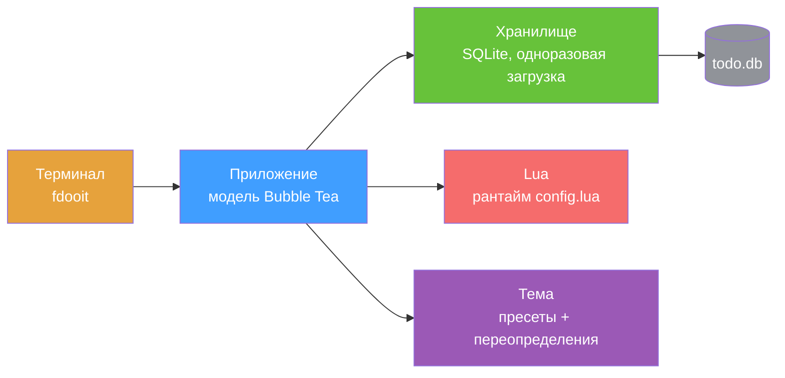

<div align="right">

[English](README.md) · [中文](README-zh.md) · [日本語](README-ja.md) · [한국어](README-ko.md) · [Español](README-es.md) · [Français](README-fr.md) · [Русский](README-ru.md) · [Deutsch](README-de.md) · [Português](README-pt-br.md)

</div>

<h1 align="center">faster-dooit</h1>

<p align="center">
  <strong>Ваше приложение задач открывается две секунды? Это — нет.</strong>
  <br />
  <em>менеджер задач в терминале в стиле vim · Go + Bubble Tea · 10 000 задач за ~34 мс</em>
</p>

<p align="center">
  <a href="#быстрый-старт"></a>
  <a href="LICENSE"></a>
</p>

<p align="center">
  <a href="https://github.com/XiaTian-AC/faster-dooit/releases"></a>
  
  
  
</p>

> **Не связано с официальным проектом [dooit](https://github.com/dooit-org/dooit)** — это независимый порт, написанный с нуля. Любительский проект при поддержке ИИ.

## Почему

Ваш инструмент задач не должен заставлять ждать. Оригинальный dooit платит **1,9 с** холодного старта и перестраивает всё дерево на каждом кадре. faster-dooit загружает **10 000 задач за ~34 мс**, рендерит только видимое и никогда не опрашивает базу данных. Это vim для ваших задач.

## Возможности

- ⚡ **Достаточно быстро, чтобы казаться мгновенным** — 10k задач за ~34 мс; оригинал ~1,9 с на той же машине
- 🎯 **Мышечная память vim** — `j`/`k` перемещение, `a` добавить, `d 3d` срок, `c` завершить
- 🗂️ **Двухпанельное дерево со сворачиванием** — вложенные workspaces и задачи, `z`/`Z` для сворачивания, `collapse_depth` для авто-сворачивания глубоких узлов
- 🎨 **Темы, которые подходят** — 7 пресетов (`nord`, `dracula`, `catppuccin_mocha`…) плюс переопределение цветов и прозрачные фоны
- 🔌 **Чистая настройка Lua** — без префикса `api.`: `theme.name`, `keys.set`, `vars.urgency_colors`
- 📦 **Один статический бинарник** — чистый Go, без CGO, без рантайма, без дерева зависимостей для аудита

## Быстрый старт

```bash
# macOS / Linux
curl -fsSL https://raw.githubusercontent.com/XiaTian-AC/faster-dooit/main/install.sh | bash
```

```powershell
# Windows
iwr -useb https://raw.githubusercontent.com/XiaTian-AC/faster-dooit/main/install.ps1 | iex
```

Или через ваш пакетный менеджер:

```bash
brew tap XiaTian-AC/XiaTian-AC-bucket && brew install faster-dooit   # macOS/Linux
scoop bucket add faster-dooit https://github.com/XiaTian-AC/XiaTian-AC-bucket && scoop install faster-dooit  # Windows
```

Команда — `fdooit`. Сборка из исходников требует только Go ≥ 1.22.

## Использование

```bash
fdooit
```

```text
┌─ Workspaces ────────────────┐  ┌─ Todos ───────────────────────────────┐
│  ⌄ Work                     │  │  ⌄ o  finish release notes   @today   │
│  > Personal                 │  │    o  write the spec                  │
└─────────────────────────────┘  └───────────────────────────────────────┘
```

- `a` добавить задачу · `A` добавить дочернюю · `c` переключить завершение · `d` установить срок (`tomorrow`, `3d`, `next monday`)
- `z`/`Z` свернуть узел / родителя · `o` развернуть длинное описание
- `S` поиск · `ctrl+s` сортировка · `y`/`Y` копировать · `p`/`P` вставить · `?` справка
- Пустые колонки (без due/recurrence) скрываются автоматически; полоса прокрутки на низких терминалах

## Архитектура



Модель производительности — три осознанных решения: **одноразовая загрузка** (БД в память при старте, запись на лету), **рендер только видимой области** (кэш строк по `pane,id,version`) и **прямой SQLite** (чистый Go, без CGO, одно соединение).

## Конфигурация

`config.lua` находится в `~/.config/faster-dooit/config.lua` (все платформы). Неверный файл выводит ошибку `file:line` и завершает работу.

| Настройка | Пример |
|---|---|
| Тема | `theme.name = "dracula"` |
| Переопределение цвета | `theme.primary = "#FF79C6"` |
| Прозрачный фон | `theme.background = "transparent"` |
| Глубина сворачивания | `vars.collapse_depth = 0` |
| Строк длинного описания | `vars.max_description_lines = 3` |
| Переназначение клавиши | `keys.set("i", add_sibling)` |
| Строка состояния | `bar.set({ fn, fn, ... })` |

Пресеты: `nord`, `catppuccin_mocha`, `catppuccin_latte`, `dracula`, `gruvbox_dark`, `solarized_light`, `tokyo_night`. Двенадцать переопределяемых цветов плюс `urgency_colors`.

## API

faster-dooit предоставляет **Lua API** (осознанное подмножество исходной Python-поверхности) для настройки:

| API | Назначение |
|---|---|
| `keys.set(key\|{keys}, action)` | Переназначение клавиш |
| `formatter.todos.<field>.add(fn)` | Стилизация колонок |
| `bar.set({fn, ...})` | Своя строка состояния |
| `dashboard.set({line, ...})` | Приветственный экран |
| `theme` / `vars` | Цвета, пресеты, глубина сворачивания, макс. строк |
| `notify(msg, level)` / `now(fmt)` | Обратная связь и время |
| `subscribe(event, fn)` / `timer(sec, fn)` | События и периодические вызовы |

## Структура каталогов

```
faster-dooit/
├── main.go                  # вход: флаги, пути, запуск TUI
├── internal/
│   ├── app/                 # модель Bubble Tea: режимы, клавиши, рендер, скроллбар
│   ├── model/               # дерево в памяти: Workspace/Todo, каскады
│   ├── store/               # персистентность SQLite: одноразовая загрузка
│   ├── lua/                 # оценка config.lua в песочнице
│   ├── theme/               # разрешённая тема + 7 пресетов
│   └── dateparse/           # даты на естественном языке ("tomorrow", "3d")
├── install.sh / install.ps1 # установщики в одну строку
└── config.lua               # конфигурация пользователя по умолчанию
```

## Технологический стек

| Слой | Технология |
|---|---|
| Язык | Go |
| TUI | [Bubble Tea](https://github.com/charmbracelet/bubbletea), lipgloss |
| База данных | SQLite (`modernc.org/sqlite`, чистый Go) |
| Конфигурация | gopher-lua (песочница) |
| Релиз | GoReleaser + GitHub Actions |

## Вклад

1. Сделайте форк репозитория
2. Создайте ветку (`git checkout -b feat/amazing`)
3. Зафиксируйте изменения
4. Запушьте и откройте Pull Request

```bash
go test ./...        # unit + parity + e2e
go vet ./...
go test ./internal/app/ -bench . -benchmem   # перф-пороги
```

## Лицензия

[MIT](LICENSE)
