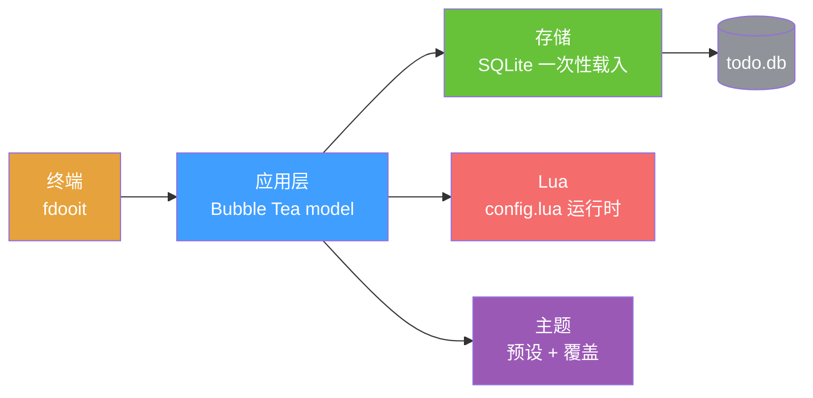

<div align="right">

[English](README.md) · [中文](README-zh.md) · [日本語](README-ja.md) · [한국어](README-ko.md) · [Español](README-es.md) · [Français](README-fr.md) · [Русский](README-ru.md) · [Deutsch](README-de.md) · [Português](README-pt-br.md)

</div>

<h1 align="center">faster-dooit</h1>

<p align="center">
  <strong>你的待办工具要等两秒才打开。这个不用。</strong>
  <br />
  <em>vim 风格终端待办管理器 · Go + Bubble Tea · 1 万个待办只需 ~34 ms</em>
</p>

<p align="center">
  <a href="#快速开始"></a>
  <a href="LICENSE"></a>
</p>

<p align="center">
  <a href="https://github.com/XiaTian-AC/faster-dooit/releases"></a>
  
  
  
</p>

> **与官方 [dooit](https://github.com/dooit-org/dooit) 项目无关**——这是一个独立的从零重写移植。AI 协作的个人爱好项目。

## 为什么

待办工具不该让你等。原版 dooit 冷启动要 **1.9 s**，而且每一帧都重建整棵树。faster-dooit 加载 **1 万个待办只需 ~34 ms**，只渲染可见部分，从不轮询数据库。这是 vim，用在你的待办上。

## 功能特性

- ⚡ **快得感觉不到** — 1 万个待办冷载入 ~34 ms；同机原版约 1.9 s
- 🎯 **vim 肌肉记忆** — `j`/`k` 移动，`a` 添加，`d 3d` 设截止日期，`c` 完成
- 🗂️ **双栏树** — 嵌套工作区 + 待办、完成级联、自然语言日期、循环
- 🎨 **真正合身的主题** — 7 套内置预设（`nord`、`dracula`、`catppuccin_mocha`…）加单色覆盖和透明背景
- 🔌 **Lua 配置** — 重映射键位、定制列样式、自建状态栏——全在 `config.lua`
- 📦 **单个静态二进制** — 纯 Go、无 CGO、无运行时、无需审计的依赖树

## 快速开始

```bash
# macOS / Linux
curl -fsSL https://raw.githubusercontent.com/XiaTian-AC/faster-dooit/main/install.sh | bash
```

```powershell
# Windows
iwr -useb https://raw.githubusercontent.com/XiaTian-AC/faster-dooit/main/install.ps1 | iex
```

或者用包管理器：

```bash
brew tap XiaTian-AC/XiaTian-AC-bucket && brew install faster-dooit   # macOS/Linux
scoop bucket add faster-dooit https://github.com/XiaTian-AC/XiaTian-AC-bucket && scoop install faster-dooit  # Windows
```

命令是 `fdooit`。源码构建只需 Go ≥ 1.22。

## 使用方法

```bash
fdooit
```

```text
┌─ Workspaces ────────────────┐  ┌─ Todos ───────────────────────────────┐
│  Work                       │  │  o  finish release notes     @today   │
│  Personal                   │  │  o  write the spec                    │
└─────────────────────────────┘  └───────────────────────────────────────┘
```

- `a` 添加待办 · `A` 添加子项 · `c` 切换完成 · `d` 设置截止日期（`tomorrow`、`3d`、`next monday`）
- `S` 搜索 · `ctrl+s` 排序 · `y`/`Y` 复制 · `p`/`P` 粘贴 · `?` 帮助
- 矮终端自动出现滚动条——thumb 跟随你的位置

## 架构



性能模型是三处刻意的取舍：**一次性载入**（启动读库到内存、编辑即写回）、**仅视口渲染**（按 `pane,id,version` 缓存行）、**直接 SQLite**（纯 Go 无 CGO、单连接）。

## 配置

`config.lua` 位于 `~/.config/faster-dooit/config.lua`（全平台统一）。无效配置会打印 `file:line` 错误并退出。

| 设置 | 示例 |
|---|---|
| 主题 | `api.vars.theme.name = "dracula"` |
| 颜色覆盖 | `api.vars.theme.primary = "#FF79C6"` |
| 透明背景 | `api.vars.theme.background = "transparent"` |
| 重映射键位 | `api.keys.set("i", api.add_sibling)` |
| 状态栏 | `api.bar.set({ fn, fn, ... })` |

内置主题：`nord`、`catppuccin_mocha`、`catppuccin_latte`、`dracula`、`gruvbox_dark`、`solarized_light`、`tokyo_night`。12 种可覆盖颜色加 `urgency_colors`。

## API

faster-dooit 提供 **Lua API**（原版 Python 表面的刻意精简子集）用于定制：

| API | 用途 |
|---|---|
| `api.keys.set(key\|{keys}, action)` | 重映射键位 |
| `api.formatter.todos.<field>.add(fn)` | 定制待办列样式 |
| `api.bar.set({fn, ...})` | 自定义状态栏 |
| `api.dashboard.set({line, ...})` | 欢迎面板 |
| `api.vars.theme` | 颜色 + 预设 |
| `subscribe(event, fn)` / `timer(sec, fn)` | 事件与定时回调 |

## 目录结构

```
faster-dooit/
├── main.go                  # 入口：flags、路径、TUI 启动
├── internal/
│   ├── app/                 # Bubble Tea model：模式、键位、渲染、滚动条
│   ├── model/               # 内存树：Workspace/Todo、级联规则
│   ├── store/               # SQLite 持久化：一次性载入、即写即存
│   ├── lua/                 # 沙箱 config.lua 求值
│   ├── theme/               # 解析后的主题 + 7 套内置预设
│   └── dateparse/           # 自然语言日期（"tomorrow"、"3d"）
└── config.lua               # 默认用户配置
```

## 技术栈

| 层 | 技术 |
|---|---|
| 语言 | Go |
| TUI | [Bubble Tea](https://github.com/charmbracelet/bubbletea)、lipgloss |
| 数据库 | SQLite（`modernc.org/sqlite`，纯 Go） |
| 配置 | gopher-lua（沙箱） |
| 发布 | GoReleaser + GitHub Actions |

## 贡献

1. Fork 本仓库
2. 创建分支（`git checkout -b feat/amazing`）
3. 提交你的改动
4. Push 并打开 Pull Request

```bash
go test ./...        # unit + parity + e2e
go vet ./...
go test ./internal/app/ -bench . -benchmem   # 性能门禁
```

## 许可证

[MIT](LICENSE)
