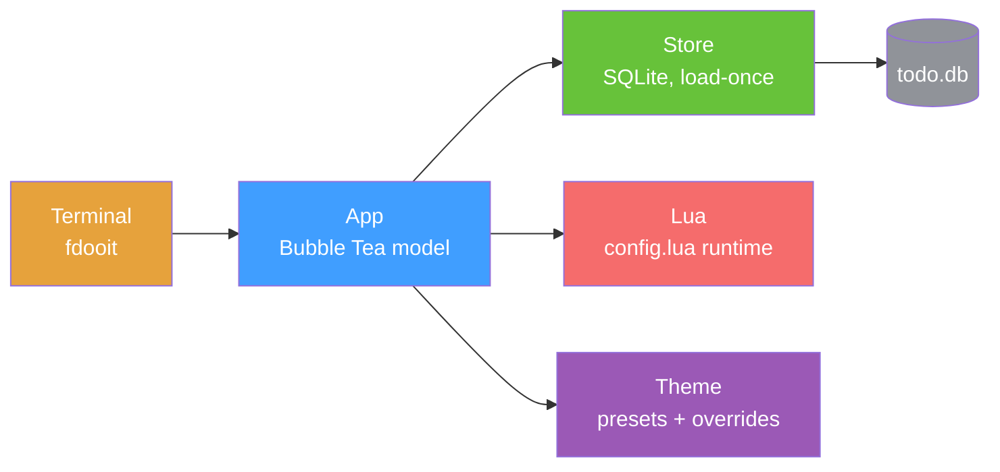

<div align="right">

[English](README.md) · [中文](README-zh.md) · [日本語](README-ja.md) · [한국어](README-ko.md) · [Español](README-es.md) · [Français](README-fr.md) · [Русский](README-ru.md) · [Deutsch](README-de.md) · [Português](README-pt-br.md)

</div>

<pre align="center">
███████╗██████╗  ██████╗  ██████╗ ██╗████████╗
██╔════╝██╔══██╗██╔═══██╗██╔═══██╗██║╚══██╔══╝
█████╗  ██║  ██║██║   ██║██║   ██║██║   ██║   
██╔══╝  ██║  ██║██║   ██║██║   ██║██║   ██║   
██║     ██████╔╝╚██████╔╝╚██████╔╝██║   ██║   
╚═╝     ╚═════╝  ╚═════╝  ╚═════╝ ╚═╝   ╚═╝   
</pre>
<h1 align="center">faster-dooit</h1>

<p align="center">
  <strong>Your todo app takes two seconds to open. This one doesn't.</strong>
  <br />
  <em>vim-style terminal todo manager · Go + Bubble Tea · 10k todos in ~34 ms</em>
</p>

<p align="center">
  <a href="#quick-start"></a>
  <a href="LICENSE"></a>
</p>

<p align="center">
  <a href="https://github.com/XiaTian-AC/faster-dooit/releases"></a>
  
  
  
</p>

> **Not affiliated with the official [dooit](https://github.com/dooit-org/dooit) project** — this is an independent, from-scratch port. AI-assisted hobby project.

## Why

Your todo tool shouldn't make you wait. The original dooit pays **1.9 s** cold-start and rebuilds its whole tree on every frame. faster-dooit loads **10,000 todos in ~34 ms**, renders only what's visible, and never polls the database. It's vim, for your todos.

## Features

- ⚡ **Fast enough to feel instant** — 10k todos cold-load in ~34 ms; the original takes ~1.9 s on the same machine
- 🎯 **vim muscle memory** — `j`/`k` move, `a` adds, `d 3d` sets a due date, `c` completes
- 🗂️ **Two-pane tree with folding** — nested workspaces + todos, `z`/`Z` to collapse, `collapse_depth` to auto-fold deep nodes
- 🎨 **Themes that actually fit** — 7 built-in presets (`nord`, `dracula`, `catppuccin_mocha`…) plus per-color overrides and transparent backgrounds
- 🔌 **Clean Lua config** — no `api.` prefix: `theme.name`, `keys.set`, `vars.urgency_colors`
- 📦 **Single static binary** — pure Go, no CGO, no runtime, no dependency tree to audit

## Quick Start

```bash
# macOS / Linux
curl -fsSL https://raw.githubusercontent.com/XiaTian-AC/faster-dooit/main/install.sh | bash
```

```powershell
# Windows
iwr -useb https://raw.githubusercontent.com/XiaTian-AC/faster-dooit/main/install.ps1 | iex
```

Or pick your package manager:

```bash
brew tap XiaTian-AC/XiaTian-AC-bucket && brew install faster-dooit   # macOS/Linux
scoop bucket add faster-dooit https://github.com/XiaTian-AC/XiaTian-AC-bucket && scoop install faster-dooit  # Windows
```

The command is `fdooit`. Build from source needs only Go ≥ 1.22.

## Usage

```bash
fdooit
```

```text
┌─ Workspaces ────────────────┐  ┌─ Todos ───────────────────────────────┐
│  ⌄ Work                     │  │  ⌄ o  finish release notes   @today   │
│  > Personal                 │  │    o  write the spec                  │
└─────────────────────────────┘  └───────────────────────────────────────┘
```

- `a` add a todo · `A` add a child · `c` toggle complete · `d` set due (`tomorrow`, `3d`, `next monday`)
- `z`/`Z` fold a node / its parent · `o` expand a long description
- `S` search · `ctrl+s` sort · `y`/`Y` copy · `p`/`P` paste · `?` help
- Empty columns (no due/recurrence) hide automatically; a scrollbar appears on short terminals

## Architecture



The performance model is three deliberate choices: **load-once** (DB read into memory at startup, edits write through), **viewport-only rendering** (row cache keyed by `pane,id,version`), and **direct SQLite** (pure Go, no CGO, single connection).

## Configuration

`config.lua` lives at `~/.config/faster-dooit/config.lua` (all platforms). An invalid file prints a `file:line` error and exits.

| Setting | Example |
|---|---|
| Theme | `theme.name = "dracula"` |
| Color override | `theme.primary = "#FF79C6"` |
| Transparent bg | `theme.background = "transparent"` |
| Fold depth | `vars.collapse_depth = 0` |
| Long-description lines | `vars.max_description_lines = 3` |
| Remap key | `keys.set("i", add_sibling)` |
| Status bar | `bar.set({ fn, fn, ... })` |

Built-in themes: `nord`, `catppuccin_mocha`, `catppuccin_latte`, `dracula`, `gruvbox_dark`, `solarized_light`, `tokyo_night`. Twelve overridable colors plus `urgency_colors`.

## API

faster-dooit exposes a **Lua API** (a deliberate subset of the original Python surface) for customization:

| API | Purpose |
|---|---|
| `keys.set(key\|{keys}, action)` | Remap keybindings |
| `formatter.todos.<field>.add(fn)` | Style todo columns |
| `bar.set({fn, ...})` | Custom status bar |
| `dashboard.set({line, ...})` | Welcome dashboard |
| `theme` / `vars` | Colors, presets, fold depth, max lines |
| `notify(msg, level)` / `now(fmt)` | Feedback & time |
| `subscribe(event, fn)` / `timer(sec, fn)` | Events & periodic callbacks |

## Directory Structure

```
faster-dooit/
├── main.go                  # entry: flags, paths, TUI bootstrap
├── internal/
│   ├── app/                 # Bubble Tea model: modes, keys, rendering, scrollbar
│   ├── model/               # in-memory tree: Workspace/Todo, cascade rules
│   ├── store/               # SQLite persistence: load-once, write-through
│   ├── lua/                 # sandboxed config.lua evaluation
│   ├── theme/               # resolved theme + 7 built-in presets
│   └── dateparse/           # natural-language dates ("tomorrow", "3d")
├── install.sh / install.ps1 # one-line installers
└── config.lua               # default user config
```

## Tech Stack

| Layer | Tech |
|---|---|
| Language | Go |
| TUI | [Bubble Tea](https://github.com/charmbracelet/bubbletea), lipgloss |
| Database | SQLite (`modernc.org/sqlite`, pure Go) |
| Config | gopher-lua (sandboxed) |
| Release | GoReleaser + GitHub Actions |

## Contributing

1. Fork the repo
2. Create a branch (`git checkout -b feat/amazing`)
3. Commit your changes
4. Push and open a Pull Request

```bash
go test ./...        # unit + parity + e2e
go vet ./...
go test ./internal/app/ -bench . -benchmem   # perf gates
```

## License

[MIT](LICENSE)
